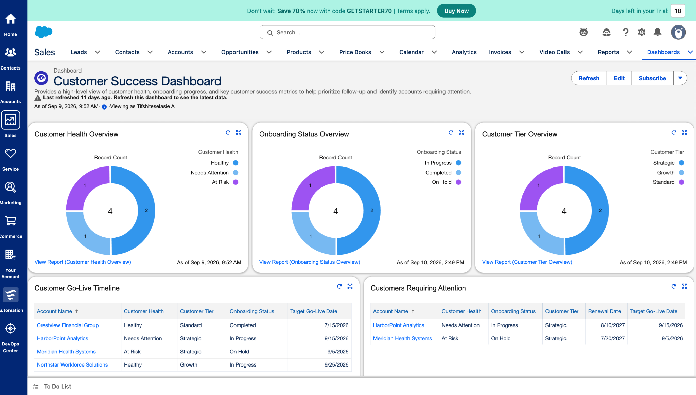
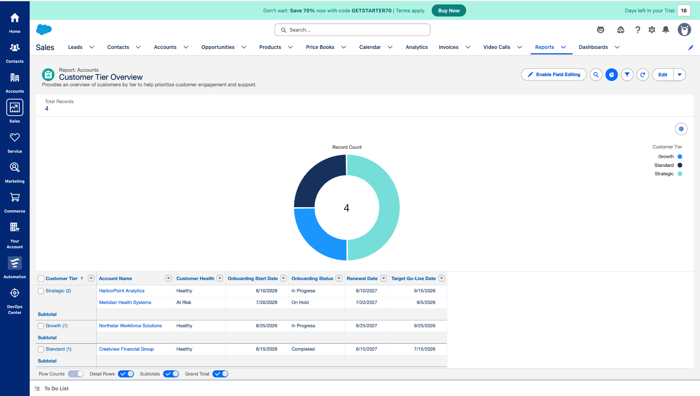
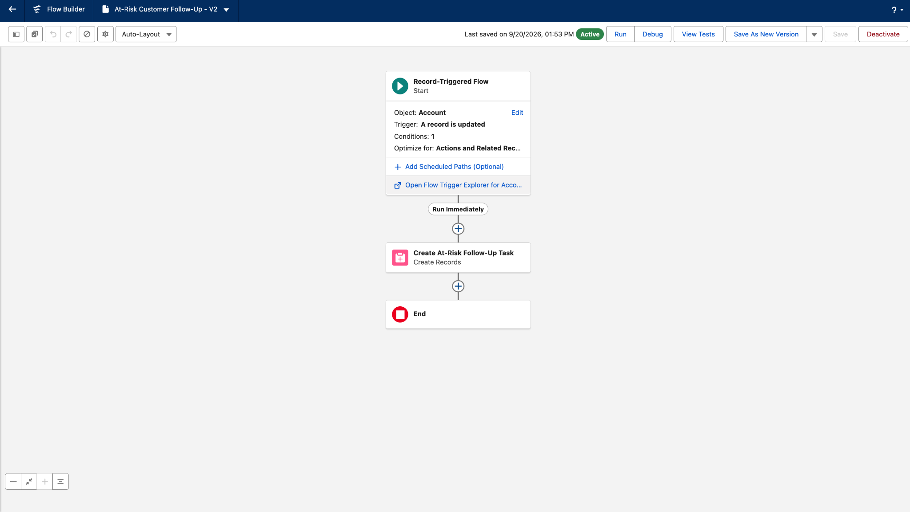

# Tifshiteselasie Amare Feleke — Salesforce Customer Success Portfolio

A portfolio documenting **Tifshiteselasie Amare Feleke’s** hands-on Salesforce Customer Success project and related CRM skills.

This repository documents a Salesforce solution built to support customer onboarding, account management, customer health monitoring, follow-up activities, reporting, dashboards, and workflow automation.

> **Portfolio website:** this repository includes a static portfolio site in `index.html` that presents the same project visually for recruiters and hiring teams. It can be deployed directly with GitHub Pages, Netlify, Vercel, or another static host.

## Selected Salesforce Project

### Customer Onboarding & Success Tracker

I built this project to simulate how a Customer Success team can use Salesforce to manage customers throughout onboarding and ongoing engagement.

The project tracks customer information, onboarding progress, customer health, important lifecycle dates, and follow-up activities. It also uses reports, dashboards, and Salesforce Flow to help identify customers who may need additional attention.

### Customer Success Process

**Customer Account → Onboarding → Adoption & Health Monitoring → Follow-Up → Reporting → Automation**

## Project Documentation

### Account & Contact Management

I created fictional customer accounts and contacts to represent different customer situations and stages of the customer lifecycle, including:

- Healthy customers progressing through onboarding
- Customers experiencing adoption challenges
- At-risk customers requiring intervention
- Successfully onboarded customers

### Custom Customer Success Fields

The Account object includes:

- Onboarding Status
- Customer Health
- Customer Tier
- Onboarding Start Date
- Target Go-Live Date
- Renewal Date

These fields provide a structured way to monitor onboarding progress and customer status.

## Reports

I created operational Salesforce reports to monitor the portfolio and identify accounts requiring attention:

- Customer Health Overview
- Onboarding Status Overview
- Customer Tier Overview
- Customer Go-Live Timeline
- Customers Requiring Attention

## Customer Success Dashboard

The dashboard combines high-level portfolio visibility with account-level detail:

- Customer Health distribution
- Onboarding Status
- Customer Tier
- Customer Go-Live Timeline
- Customers Requiring Attention

The dashboard helps turn customer data into information that can be used to prioritize follow-up and monitor onboarding progress.



## Customer Health Reporting

The Customer Health Overview groups accounts by health status and displays lifecycle fields such as onboarding status, customer tier, start date, target go-live date, and renewal date.



## Salesforce Flow Automation

I created an active **Record-Triggered Flow** that automatically creates a follow-up task when a customer's **Customer Health** changes to **At Risk**.

The automation:

1. Detects when an Account becomes At Risk
2. Creates a follow-up Task
3. Assigns the Task to the Account Owner
4. Relates the Task to the customer Account
5. Sets the Task priority to High
6. Sets the due date for three days after the customer becomes At Risk

This helps ensure that at-risk customers receive timely follow-up.



## Salesforce Skills Demonstrated

- Account and Contact Management
- Custom Fields
- Customer Onboarding Tracking
- Customer Health Monitoring
- Customer Lifecycle Management
- Task and Activity Management
- Salesforce Reports
- Salesforce Dashboards
- Record-Triggered Flows
- Workflow Automation
- Salesforce Lightning

## Tools

- Salesforce
- Salesforce Flow
- Salesforce Reports & Dashboards
- GitHub
- HTML, CSS, JavaScript (portfolio presentation layer)

## Website Files

The repository is deployment-ready as a static site:

```text
index.html
styles.css
script.js
customer-success-dashboard.png
customer-health-overview.png
at-risk-customer-flow.png
Tifshiteselasie-Amare-Feleke-Resume.docx
README.md
```

No build step or framework is required. The site uses relative file paths so it can be deployed directly from the repository root.

## Notes

All customer names, contact details, and Salesforce records shown in this project are **fictional demo data** created for learning and portfolio purposes.
